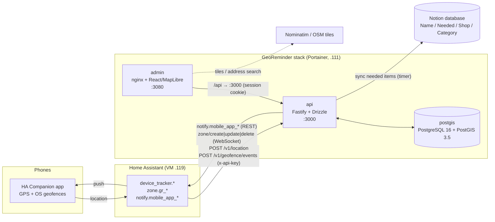

# GeoReminder

Geolocation rules service + admin UI. Family members get a push notification (through Home Assistant)
when they approach a shop where the Notion shopping list has items to buy. The same API will serve a
calendar app later.

- **Places, rules, radii, recipients, notification config** → this service (PostGIS), managed in the web admin.
- **Shopping items** → Notion (cached locally in `notion_items`; keeps working when Notion is down).
- **Location + push delivery** → Home Assistant Companion app (thin client). FCM channel slot reserved.

## Architecture



Evaluation on every fix: plausibility check → upsert current position → PostGIS candidate query
(`ST_DWithin` on active places, plus places the person is currently inside) → geofence state machine per
person × place (approach / enter / exit / dwell with 25 % exit hysteresis, accuracy gating) → for each
transition, the enabled rules of that place (or its groups): recipient for this person → time window and
days → cooldown → daily cap → cached Notion items (min count, categories) → render template → send through
the recipient's channel → write `rule_events` with the reason.

## Repository layout

```
apps/api        Fastify 5 API, Drizzle ORM, migrations (drizzle/), Notion + Home Assistant integrations, tests
apps/admin      React + Vite + MapLibre admin UI (served by nginx, /api proxied to the API)
packages/shared zod schemas and types shared by both
docker-compose.yml            pre-production stack (pulls images from GHCR; Portainer-friendly)
docker-compose.dev.yml        overlay: build images locally
docker-compose.homelab.yml    overlay: attach to an external Docker network
.github/workflows/ci.yml      lint + typecheck + unit + PostGIS integration tests, multi-arch images to GHCR
DECISIONS.md                  every default that was chosen and why
```

## API

OpenAPI/Swagger UI at `http://<api>:3000/docs` (through the admin: `http://<admin>:3080/api/docs`).
Machine clients send `x-api-key: <API_KEY>`; the admin UI uses a session cookie.

| Method    | Path                                                                                                                                               | Purpose                                                                                     |
| --------- | -------------------------------------------------------------------------------------------------------------------------------------------------- | ------------------------------------------------------------------------------------------- |
| `POST`    | `/v1/location`                                                                                                                                     | `{person, lat, lng, accuracy_m, recorded_at}` or an array of them; evaluates rules          |
| `POST`    | `/v1/geofence/events`                                                                                                                              | `{person, zone \| place_id, transition: enter\|exit, recorded_at, lat?, lng?, accuracy_m?}` |
| `GET`     | `/v1/nearby?lat=&lng=&radius=&limit=`                                                                                                              | places within radius, sorted by distance                                                    |
| `CRUD`    | `/v1/places`, `/v1/place-groups`, `/v1/rules`, `/v1/recipients`, `/v1/channels`                                                                    | configuration                                                                               |
| `GET`     | `/v1/places/{id}/items`                                                                                                                            | cached Notion items that would be sent for this place                                       |
| `POST`    | `/v1/places/{id}/zone-sync`, `/v1/ha/zones/sync`                                                                                                   | Home Assistant zone sync                                                                    |
| `POST`    | `/v1/channels/{id}/test`, `GET …/targets`, `POST …/send-test`                                                                                      | connection test, `notify.*` discovery, test push                                            |
| `GET/PUT` | `/v1/notion/config`, `POST /v1/notion/test`, `GET /v1/notion/schema`, `POST /v1/notion/sync`, `GET /v1/notion/items`, `GET /v1/notion/consistency` | Notion                                                                                      |
| `GET`     | `/v1/events?person=&place=&rule=&outcome=&from=&to=&limit=&before_id=`                                                                             | event log                                                                                   |
| `GET`     | `/v1/persons` · `DELETE /v1/location?person=`                                                                                                      | current positions (rounded) · erase a person                                                |
| `GET`     | `/v1/health`, `/v1/ready`                                                                                                                          | liveness / readiness (DB + PostGIS)                                                         |
| `GET`     | `/v1/geocode/search?q=`                                                                                                                            | Nominatim proxy for the admin map                                                           |

Conventions: JSON, ISO-8601 timestamps, decimal degrees, metres, `person` is a short id you choose (`alex`).

## Local development

```bash
corepack enable && pnpm install
docker compose up -d postgis                       # or any PostGIS 16
cp .env.example .env                               # fill DATABASE_URL, API_KEY, JWT_SECRET, ENCRYPTION_KEY, ADMIN_PASSWORD
pnpm --filter @georeminder/shared build
pnpm dev:api                                       # http://localhost:3000/docs
pnpm dev:admin                                     # http://localhost:5173 (proxies /api to :3000)
pnpm lint && pnpm typecheck && pnpm test:unit
pnpm test:integration                              # needs Docker (testcontainers pulls imresamu/postgis:16-3.5)
docker compose -f docker-compose.yml -f docker-compose.dev.yml up -d --build   # full stack from source
```

Migrations: edit `apps/api/src/db/schema.ts`, run `pnpm --filter @georeminder/api db:generate`, review the SQL in
`apps/api/drizzle/`. They are applied automatically at API start (`RUN_MIGRATIONS=true`).

## Pre-production on Portainer (Raspberry Pi `portainer-local`, 192.168.1.111)

Images are multi-arch (amd64 + arm64) and published by CI to `ghcr.io/bacchusor/georeminder-{api,admin}`
with tags `pre` (main), `<branch>` and `sha-<short>`.

1. The GHCR packages are private (default for a personal repo): log the host in once with a token that has `read:packages`: `echo $GITHUB_TOKEN | docker login ghcr.io -u <user> --password-stdin`
   (Portainer: Registries → add `ghcr.io` with the same credentials).
2. Portainer → Stacks → Add stack → name `georeminder` → paste `docker-compose.yml` (or use the Git
   repository option pointing at this repo, compose path `docker-compose.yml`).
3. Environment variables: paste the content of `.env.example` and set at least `POSTGRES_PASSWORD`, `API_KEY`,
   `JWT_SECRET`, `ENCRYPTION_KEY` (64 hex), `ADMIN_PASSWORD`, `HA_URL`, `HA_TOKEN`, `PUBLIC_API_URL`.
   Generate secrets with `openssl rand -hex 32`.
4. Deploy. `api` waits for `postgis` to be healthy, runs the migrations, then listens on `:3000`; `admin` on `:3080`.
5. Check: `curl http://192.168.1.111:3000/v1/ready` → `{"status":"ready","postgis":"3.4.x"}`; open
   `http://192.168.1.111:3080`, log in, add a channel test, create a place.

Equivalent CLI deploy: `scripts/deploy-preprod.sh` (ssh + `docker compose up -d` in `/opt/georeminder`).

### Backups

```bash
# database (run on the host; the volume is georeminder_georeminder-pgdata under /var/lib/docker/volumes)
docker exec georeminder-postgis pg_dump -U georeminder -d georeminder -Fc > georeminder-$(date +%F).dump
# restore
docker exec -i georeminder-postgis pg_restore -U georeminder -d georeminder --clean --if-exists < georeminder-YYYY-MM-DD.dump
```

Also keep the stack's environment variables: without `ENCRYPTION_KEY` the stored Notion / HA tokens are unreadable.

## Home Assistant setup

1. Create a long-lived access token (profile → Security) and paste it in the admin (Recipients & Channels →
   channel) or in `HA_TOKEN` before the first start.
2. Recipients: one per phone, `person` = the id you will send from HA, target = `notify.mobile_app_<phone>`
   (the admin lists them from `/api/services`). "Send test" checks the push path.
3. Saving a place creates/updates the zone `zone.gr_<place>` in HA (Settings → Areas & zones → Zones). The
   Companion app registers OS geofences for HA zones, which is what drives the zone events below.
4. Forward positions and zone events with a `rest_command` and two automations (`configuration.yaml` /
   `secrets.yaml`):

```yaml
# secrets.yaml
georeminder_api_key: '<API_KEY>'

# configuration.yaml
rest_command:
  georeminder_location:
    url: 'http://192.168.1.111:3000/v1/location'
    method: POST
    headers:
      x-api-key: !secret georeminder_api_key
      content-type: application/json
    payload: >-
      {"person": "{{ person }}", "lat": {{ lat }}, "lng": {{ lng }},
       "accuracy_m": {{ accuracy | default(0) }}, "recorded_at": "{{ recorded_at }}"}
  georeminder_zone_event:
    url: 'http://192.168.1.111:3000/v1/geofence/events'
    method: POST
    headers:
      x-api-key: !secret georeminder_api_key
      content-type: application/json
    payload: >-
      {"person": "{{ person }}", "zone": "{{ zone }}", "transition": "{{ transition }}",
       "recorded_at": "{{ recorded_at }}"}
```

```yaml
# automations.yaml — one pair per person; replace device_tracker.alex_phone / alex
- alias: "GeoReminder – forward Alex's position"
  mode: queued
  trigger:
    - platform: state
      entity_id: device_tracker.alex_phone
      attribute: latitude
    - platform: state
      entity_id: device_tracker.alex_phone
      attribute: longitude
  condition:
    - condition: template
      value_template: '{{ trigger.to_state.attributes.latitude is not none }}'
  action:
    - service: rest_command.georeminder_location
      data:
        person: alex
        lat: '{{ trigger.to_state.attributes.latitude }}'
        lng: '{{ trigger.to_state.attributes.longitude }}'
        accuracy: '{{ trigger.to_state.attributes.gps_accuracy | default(0) }}'
        recorded_at: '{{ trigger.to_state.last_updated.isoformat() }}'

- alias: "GeoReminder – Alex's zone events"
  mode: queued
  trigger:
    - platform: state
      entity_id: device_tracker.alex_phone
  condition:
    - condition: template
      value_template: >-
        {{ trigger.from_state is not none and trigger.to_state.state != trigger.from_state.state
           and (trigger.to_state.state.startswith('GR ') or trigger.from_state.state.startswith('GR ')) }}
  action:
    - if: "{{ trigger.from_state.state.startswith('GR ') }}"
      then:
        - service: rest_command.georeminder_zone_event
          data:
            person: alex
            zone: '{{ trigger.from_state.state }}'
            transition: exit
            recorded_at: '{{ now().isoformat() }}'
    - if: "{{ trigger.to_state.state.startswith('GR ') }}"
      then:
        - service: rest_command.georeminder_zone_event
          data:
            person: alex
            zone: '{{ trigger.to_state.state }}'
            transition: enter
            recorded_at: '{{ now().isoformat() }}'
```

The `device_tracker` state is the zone's friendly name (`GR Lidl`); the API resolves it to the place. Position
updates arrive whenever the Companion app reports (every few minutes, or on significant movement); the zone
events are the precise, battery-friendly enter/exit signal. Both feed the same evaluator.

## Notion setup

1. notion.so/profile/integrations → new internal integration → copy the token (`ntn_…`).
2. Open the shopping database → ⋯ → Connections → add the integration.
3. Database properties: `Name` (title), `Needed` (checkbox), `Shop` (select), `Category` (select). Names are
   configurable in the admin (Notion → property mapping), including which checkbox state means "needed".
4. Admin → Notion → paste token + database URL → Test connection → Save → Sync now. Automatic sync runs at the
   configured interval (default 5 min) inside the API.
5. Map & Places: bind each place to a `Shop` option (dropdown fed live from the database schema). The page warns
   when a Shop option has no place or a place points at a missing option.

## Troubleshooting

| Symptom                                       | Check                                                                                                                                                                                                                                                 |
| --------------------------------------------- | ----------------------------------------------------------------------------------------------------------------------------------------------------------------------------------------------------------------------------------------------------- |
| `api` unhealthy, logs `Invalid configuration` | a required variable is missing/short (`API_KEY` ≥ 16, `JWT_SECRET` ≥ 32, `ENCRYPTION_KEY` = 64 hex, `ADMIN_PASSWORD` ≥ 8)                                                                                                                             |
| `api` restarts with `ECONNREFUSED` to postgis | `postgis` not healthy yet (first start initialises the volume, ~20 s on a Pi); compose retries                                                                                                                                                        |
| `POST /v1/location` → 401                     | header `x-api-key` missing or wrong; 400 = validation (lat/lng ranges, `recorded_at` ISO-8601)                                                                                                                                                        |
| Fix accepted but nothing fires                | Event log: `ignored` (stale/out-of-order/implausible), `transition` without rule, or `skipped` with the reason (recipient person mismatch, window, cooldown, daily cap, no Notion items, accuracy). Persons on the map show the last stored position. |
| HA zone error on a place                      | channel token must belong to an **admin** user (zone WebSocket commands are admin-only); check the channel "Test"                                                                                                                                     |
| `notify` fails with 400                       | the target must be a `notify.mobile_app_*` service name; use the dropdown                                                                                                                                                                             |
| Notion `object_not_found`                     | the integration is not connected to the database (step 2), or the id is a page, not a database                                                                                                                                                        |
| Address search empty / 429                    | Nominatim rate limit: the API throttles to 1 req/s and caches; set a real contact in `NOMINATIM_USER_AGENT`                                                                                                                                           |
| Map tiles missing                             | the browser must reach `tile.openstreetmap.org`; or set `VITE_TILE_URL` at build time to a local tile server                                                                                                                                          |
| Logs                                          | `docker logs georeminder-api` (JSON; `LOG_LEVEL=debug` adds request logs and rounded coordinates)                                                                                                                                                     |
| Events log growing                            | purged automatically after `EVENT_RETENTION_DAYS`; `GET /v1/events?limit=1` shows the newest id                                                                                                                                                       |
